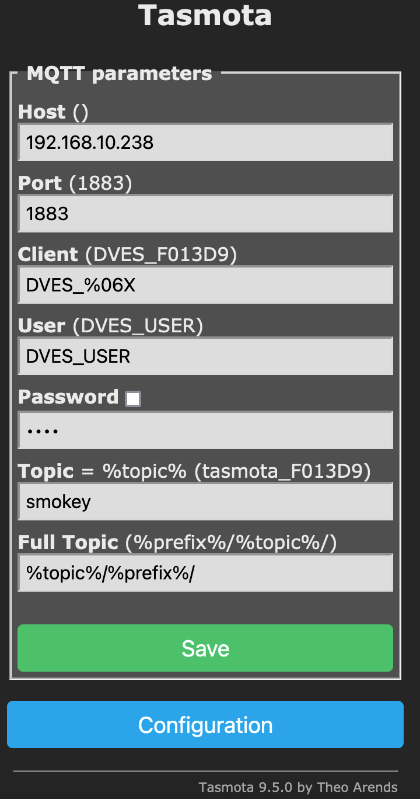

# smokey
Golang based manager for controlling Asakuki Aroma Diffuser running Tasmota.

This repo gives us a controller binary that monitors and manages the
light+diffuser, after flashing it with [Tasmota](https://tasmota.github.io/docs/About/).
A good usage case for this is to connect the device to [Alexa](https://developer.amazon.com/en-US/alexa),
using [fauxmo](https://github.com/flavio-fernandes/fauxmo/commit/4dee404d88fef3a108707672df200dd328235bde).

# Preparation

- Buy an Asakuki 500ml Aroma Diffuser ([Amazon](https://www.amazon.com/ASAKUKI-Compatible-Aromatherapy-Humidifier-Office-Better/dp/B07C2H2N67/))
- Flash it with Tasmota
  - https://tasmota.github.io/docs/Tuya-Convert/
  - https://youtu.be/imKZbhJ8lvU
  - https://www.thingiverse.com/thing:4099748
  - https://templates.blakadder.com/asakuki.html
  - https://tasmota.github.io/docs/Commands/
- Install [Golang](https://golang.org/doc/install)
- Clone [this repo](https://github.com/flavio-fernandes/smokey)
- Build
  - `cd ./cmd/smokey && go build`
- Adapt [services file](dist/smokey.service) and install it
- Install and run an MQTT server

# Tasmota config

Configure the device according to what is documented on the
[Tasmota page](https://templates.blakadder.com/asakuki.html).



Under configuration, set the MQTT prefix as shown above.
If you prefer a different name or have multiple devices, make
sure to specify it using unique `-client` and `-topic` flags,
as shown below. 

# Usage

```bash
$ ./bin/smokey --help
Usage of ./bin/smokey:
  -broker string
        mqtt broker url (default "tcp://192.168.10.238:1883")
  -client string
        mqtt client id (default "smokey_mqtt_agent")
  -debug
        enable trace level logs
  -listenport int
        or use LISTENPORT to override (default 8080)
  -logdir string
        or use env LOGDIR to override (default "/home/ff/smokey.git/bin/log")
  -pass string
        mqtt password
  -topic string
        mqtt topic device prefix (default "smokey/")
  -user string
        mqtt username
```

Enable service and monitor using these commands:

```bash
sudo systemctl --now enable smokey.service
sudo systemctl status smokey.service

# looking at events handled (when started using -debug)
tail -F ./bin/log/smokey.ff.TRACE
```

# Rest API reference

The API can be obtained [via postman](https://www.getpostman.com/collections/0152032406339f3e7abf)
collection (or at the [json file](dist/smokey.postman_collection.json) under the dist folder).

Here are some examples using curl

```bash
URL='127.0.0.1:8080'
HEADER='Content-Type: application/x-www-form-urlencoded'

# get latest state
curl --silent ${URL}/state | jq ".Stats.GetStateHits"

# interrogate device and return state
curl --silent --request POST "${URL}/query" | jq

# get the latest state on water reservoir
curl --silent ${URL}/water

# turn light on and disable auto-shutoff
curl --request POST "${URL}/lighton" \
--header "${HEADER}" \
--data-urlencode 'autoOffSecs=0' \
--data-urlencode 'mode=solid' \
--data-urlencode 'color=random'

# change color to snow white
curl --request POST "${URL}/lightcolor" \
--header "${HEADER}" \
--data-urlencode 'color=snow'

# change color to blue using hex notation (RGB)
curl --request POST "${URL}/lightcolor" \
--header "${HEADER}" \
--data-urlencode 'color=0x0000ff'

# dim light
curl --request POST "${URL}/lightdim" \
--header "${HEADER}" \
--data-urlencode 'dim=20'

# turn light on night-time mode for 1 minute
curl --request POST "${URL}/lighton" \
--header "${HEADER}" \
--data-urlencode 'autoOffSecs=60' \
--data-urlencode 'mode=night-mode'

# turn light on increasing dim
# this is good for waking up alarms :)
curl --request POST "${URL}/lighton" \
--header "${HEADER}" \
--data-urlencode 'mode=sunshine' \
--data-urlencode 'color=blue'

# turn light on ever-changing color mode
curl --request POST "${URL}/lighton" \
--header "${HEADER}" \
--data-urlencode 'mode=crazy'

# turn light off
curl --request POST "${URL}/lightoff"

# turn diffuser on for 1 hour
curl --request POST "${URL}/smokeon" \
--header "${HEADER}" \
--data-urlencode 'autoOffSecs=3600'

# turn diffuser off
curl --request POST "${URL}/smokeoff"
```